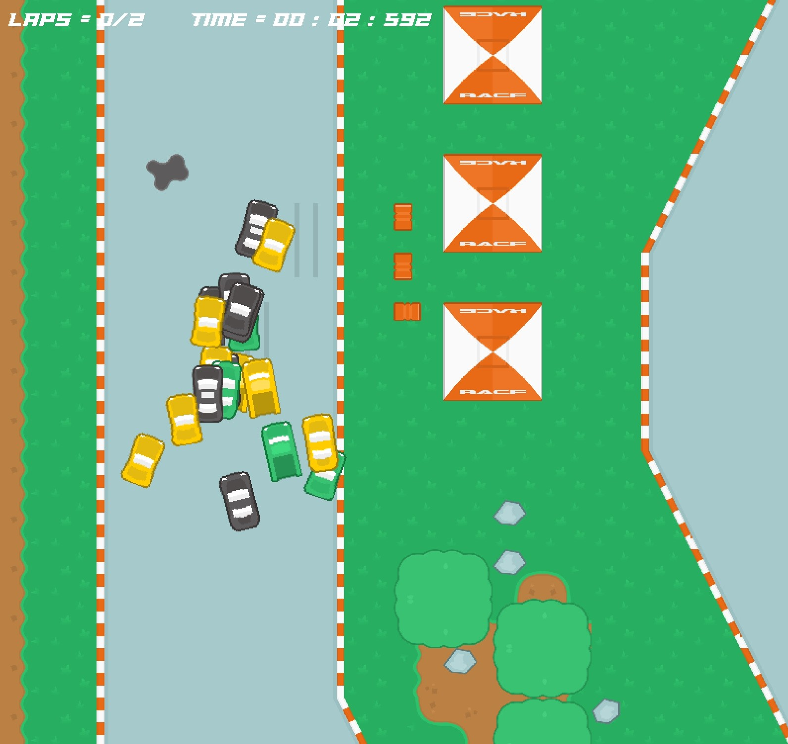

# A.I. Autonomous Driving Car

A.I. Autonomous Car is a repository that deals with the creation of a car driving game and the developement of a deep learning program that can autonomous solve this game. 

This repository uses the 
[NEAT algorithmn](https://neat-python.readthedocs.io/en/latest/ "NEAT Documentation") to create an Aritifical Intelligence based program that can drive a car throughout the driving game. NEAT (NeuroEvolution of Augmenting Topologies) is an evolutionary algorithm that creates artificial neural networks.



## Usage

There are three modules that were created: a game playing module, a machine learning training module and a running of the resulting machine learning module. 

The game-play module allows a user to drive the car by using the up-down-left-right arrows. It can be run using the command:

```bash
python3 run.py human
```

The training module displays how the NEAT algorithmn develops an autonomous driving algorithmn. It can be run using the command:

```bash
python3 run.py train
```

The run module runs the best NEAT model that was developed in the training module. It can be run using the command:

```bash
python3 run.py run
```

## Example

An implementation of this code can be seen in the following video.

[](https://youtu.be/qPHL5K4-2HM)
